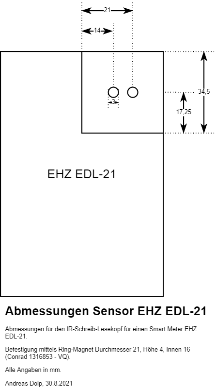

# EHZ Diagnose-Tool 1-Kanal mit Buzzer
## Aufbau und Funktionsweise
Schaltpläne, PCB und Software für ein Smart-Meter (EHZ EDL-21) Diagnose-Tool für den Arduino UNO.

Mit einem Infrarot (IR) Schreib-Lesekopf können die IR-Signale des Smart-Meters eingelesen werden.
Eine Transistorstufe bereitet die Signale auf und invertiert diese, um als RX-Signal vom Arduino
verarbeitet zu werden. Per TX können eigene Signale gesendet werden, was in der Regel jedoch nur
selten benötigt wird.

Ein Piezo Buzzer ermöglicht die Ausgabe von Diagnose-Tönen.

Die Platine kann als Arduino-Shield verwendet werden. In Kombination mit einem SD-Karten oder
Ethernet-Shield können die gelesenen Daten auf SD-Karte gespeichert oder per Ethernet versendet
werden.

## Software
Die Schaltpläne sind mit KiCAD (https://www.kicad.org/) erstellt.

Als IDE kommt die Arduino IDE (https://www.arduino.cc/en/software/) zum Einsatz.

## Hardware
Die Abmessungen des Sensors sind nachfolgend dargestellt.

## Verwandete Projekte
- eHZy (https://sourceforge.net/projects/ehzy/)
- Volkszaehler (https://wiki.volkszaehler.org/hardware/controllers/ir-schreib-lesekopf-ttl-ausgang)
